# 浏览器渲染性能优化篇

## 前言

这篇文章的起因是在做页面动画的时候，发现由 js 控制的动画总是比 css3 属性控制的动画性能要差一些，并且当页面卡顿（帧数较低）的时候，css3 的动画还是能流畅的运行，所以就产生了一系列疑问。

- setTimeout 为什么不能准时执行，raf（requestAnimationFrame） 为什么说比 setTimeout 性能更好？
- 为什么 css3 动画要比普通动画性能更佳？
- 浏览器到底是怎么处理这些 dom 渲染的？
- 和我已知的事件循环有什么关系？
- 怎么才能更好的优化渲染时性能?

围绕这些疑问，在查询了大量资料与文章以后，我尝试着梳理出一个完整的知识体系。

## 浏览的多线程机制

我们都知道 JS 是单线程语言，同一时间内只能做一件事情，而 setTimeout 是个计时器，到了指定时间以后会将回调函数放入 JS 线程执行。

那么 setTimeout 是由 JS 线程来控制的吗？如果不是又是由什么来控制的？

其实 JS 虽然是单线程语言，但是 JS 光执行代码就已经忙不过来了，其他的计时与渲染工作都是由另外的线程去辅助工作的。

浏览器每个 tab 页面会分配一个渲染进程，这个渲染进程也就是我们前端息息相关的核心，从脚本映射至页面上显示的内容，js 只是承担职责链中的其中一环。

### 浏览器有哪些常驻线程

下面列举一些渲染进程中的常驻线程：

1. GUI 渲染线程

   - 负责渲染浏览器界面，解析 HTML，CSS，构建 DOM 树和 RenderObject 树，布局和绘制等
   - 当界面需要重绘（Repaint）或由于某种操作引发回流(reflow)时，该线程就会执行
   - 注意，GUI 渲染线程与 JS 引擎线程是互斥的，当 JS 引擎执行时 GUI 线程会被挂起（相当于被冻结了），GUI 更新会被保存在一个队列中等到 JS 引擎空闲时立即被执行

2. JS 引擎线程

   - 也称为 JS 内核，负责处理 Javascript 脚本程序。（例如 V8 引擎）
   - S 引擎线程负责解析 Javascript 脚本，运行代码
   - JS 引擎一直等待着任务队列中任务的到来，然后加以处理，一个 Tab 页（renderer 进程）中无论什么时候都只有一个 JS 线程在运行 JS 程序
   - 同样注意，GUI 渲染线程与 JS 引擎线程是互斥的，所以如果 JS 执行的时间过长，这样就会造成页面的渲染不连贯，导致页面渲染加载阻塞

3. 事件触发线程

   - 归属于浏览器而不是 JS 引擎，用来控制事件循环（可以理解，JS 引擎自己都忙不过来，需要浏览器另开线程协助）
   - 当 JS 引擎执行代码块如 setTimeOut 时（也可来自浏览器内核的其他线程,如鼠标点击、AJAX 异步请求等），会将对应任务添加到事件线程中
   - 当对应的事件符合触发条件被触发时，该线程会把事件添加到待处理队列的队尾，等待 JS 引擎的处理
   - 注意，由于 JS 的单线程关系，所以这些待处理队列中的事件都得排队等待 JS 引擎处理（当 JS 引擎空闲时才会去执行）

4. 定时器触发器线程

   - 传说中的 setInterval 与 setTimeout 所在线程
   - 浏览器定时计数器并不是由 JavaScript 引擎计数的,（因为 JavaScript 引擎是单线程的, 如果处于阻塞线程状态就会影响记计时的准确）
   - 因此通过单独线程来计时并触发定时（计时完毕后，添加到事件队列中，等待 JS 引擎空闲后执行）
   - 注意，W3C 在 HTML 标准中规定，规定要求 setTimeout 中低于 4ms 的时间间隔算为 4ms。

5. 异步 http 请求线程
   - 在 XMLHttpRequest 在连接后是通过浏览器新开一个线程请求
   - 将检测到状态变更时，如果设置有回调函数，异步线程就产生状态变更事件，将这个回调再放入事件队列中。再由 JavaScript 引擎执行。

总结起来的话就是 GUI 线程、JS 引擎线程负责解析与执行脚本并渲染至页面上，事件触发线程则负责控制事件循环机制，不断的循环从任务队列里取出异步任务执行，而其他的线程都是辅助线程。

抽象点理解的话有点像发布订阅设计模式，js 主线程去订阅消息，然后定时器和异步 http 线程去发布消息，事件触发线程充当中介者的角色。

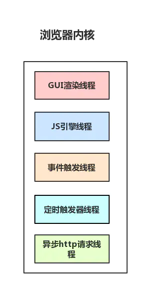

### GUI 线程与 JS 线程互斥

这点其实很好理解，GUI 线程负责解析渲染等工作，而 JS 线程又可以操控 dom，所以如果并行的话就存在渲染前后获取的数据不一致的问题，因此为了防止渲染出现不可预期的结果，浏览器设置 GUI 渲染线程与 JS 引擎为互斥的关系。

互斥的实现方式大概是当 JS 引擎执行时，GUI 线程会被挂起，GUI 更新会被保存在一个队列中等到 JS 引擎空闲时立即被执行。

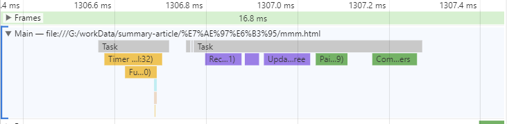

上图是浏览器 performance 监控页面动画执行的截图，黄色的是 js 执行消耗时间，紫色的代表样式计算和布局，即重排，绿色是重绘与合成图层操作，可以看出

### web worker 线程

前文中有提到 JS 引擎是单线程的，而且 JS 执行时间过长会阻塞页面，那么 JS 就真的对 cpu 密集型计算无能为力么？

所以，后来 HTML5 中支持了 Web Worker。

MDN 的官方解释是：

> Web Worker 为 Web 内容在后台线程中运行脚本提供了一种简单的方法。线程可以执行任务而不干扰用户界面。</br>
> 一个 worker 是使用一个构造函数创建的一个对象(e.g. Worker()) 运行一个命名的 JavaScript 文件。</br>
> 这个文件包含将在工作线程中运行的代码; workers 运行在另一个全局上下文中,不同于当前的 window。</br>
> 因此，使用 window 快捷方式获取当前全局的范围 (而不是 self) 在一个 Worker 内将返回错误。

web worker 也是一个辅助线程，它无法控制页面 dom 以及一些 document、window 等对象。
它的优势是帮助主线程去处理 cpu 密集型或高延迟的任务，减轻主线程的压力。

它主要靠 postMessage API 与主线程通信，并且传输的数据是经过序列化处理的，类似于深拷贝。

关于更多 worker 线程的内容，可以查看[Web Worker 使用教程](http://www.ruanyifeng.com/blog/2018/07/web-worker.html)

## 浏览器 event loop（事件循环）

了解了浏览器是具有多线程机制以后，我们再来看看常说的 event loop。

> 为了协调事件，用户交互，脚本，渲染，网络等，用户代理必须使用本节所述的 event loop。

这是 event loop 在官方规范中定义的话，事件，用户交互，脚本，渲染，网络这些都是我们所熟悉的东西，他们都是由 event loop 协调的。触发一个 click 事件，进行一次 ajax 请求，背后都有 event loop 在运作，也和上一节所说的多线程互相呼应。

同步任务在主线程上执行，形成一个执行栈，每一个函数执行的时候，都会生成新的 execution context（执行上下文），执行上下文会包含一些当前函数的参数、局部变量之类的信息，它会被推入栈中， running execution context（正在执行的上下文）始终处于栈的顶部。当函数执行完后，它的执行上下文会从栈弹出。

主线程之外，事件触发线程管理着一个任务队列，只要异步任务有了运行结果，就在任务队列之中放置一个事件。

一旦执行栈中的所有同步任务执行完毕（此时 JS 引擎空闲），系统就会读取任务队列，将可运行的异步任务添加到可执行栈中，开始执行。

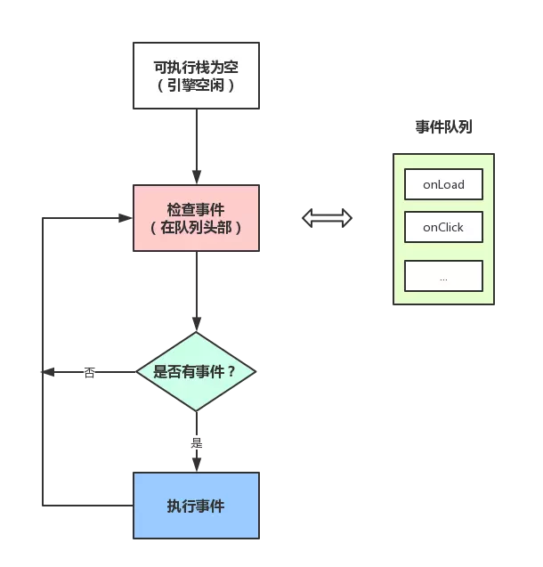

JS 中分为两种任务类型：macrotask 和 microtask, 在 ECMAScript 中，microtask 称为 jobs，macrotask 可称为 task

macrotask（又称之为宏任务），可以理解是每次执行栈执行的代码就是一个宏任务（包括每次从事件队列中获取一个事件回调并放到执行栈中执行）

microtask（又称为微任务），可以理解是在当前 task 执行结束后立即执行的任务

### 宏任务

在规范的 Processing model 定义了 event loop 的循环过程：

> 一个 event loop 只要存在，就会不断执行下边的步骤：  
> 1.在 tasks 队列中选择最老的一个 task,用户代理可以选择任何 task 队列，如果没有可选的任务，则跳到下边的 microtasks 步骤。  
> 2.将上边选择的 task 设置为正在运行的 task。<br/>
> 3.Run: 运行被选择的 task。  
> 4.将 event loop 的 currently running task 变为 null。 5.从 task 队列里移除前边运行的 task。
> 6.Microtasks: 执行 microtasks 任务检查点。（也就是执行 microtasks 队列里的任务）  
> 7.更新渲染（Update the rendering）...  
> 8.如果这是一个 worker event loop，但是没有任务在 task 队列中，并且 WorkerGlobalScope 对象的 closing 标识为 true，则销毁 event loop，中止这些步骤，然后进行定义在 Web workers 章节的 run a worker。 9.返回到第一步。

可以看到整个流程微任务在第 6 步，穿插在宏任务执行完毕后，且页面更新渲染前执行。

### 微任务

event loop 运行的第 6 步，执行了一个 microtask checkpoint，看看规范如何描述 microtask checkpoint：

> 当用户代理去执行一个 microtask checkpoint，如果 microtask checkpoint 的 flag（标识）为 false，用户代理必须运行下面的步骤：  
> 1.将 microtask checkpoint 的 flag 设为 true。
> 2.Microtask queue handling: 如果 event loop 的 microtask 队列为空，直接跳到第八步（Done）。  
> 3.在 microtask 队列中选择最老的一个任务。  
> 4.将上一步选择的任务设为 event loop 的 currently running task。  
> 5.运行选择的任务。  
> 6.将 event loop 的 currently running task 变为 null。  
> 7.将前面运行的 microtask 从 microtask 队列中删除，然后返回到第二步（Microtask queue handling）。
> 8.Done: 每一个 environment settings object 它们的 responsible event loop 就是当前的 event loop，会给 environment settings object 发一个 rejected promises 的通知。  
> 9.清理 IndexedDB 的事务。  
> 10.将 microtask checkpoint 的 flag 设为 flase。

### 为什么需要微任务？

既然宏任务可以满足常规需求，为什么需要微任务这么一个概念呢。

我的理解是宏任务相当于排列好的一个行程单，但是人生难免会出意外，而微任务队列就是留给我们处理紧急情况的一个解决方案，毕竟任务也分优先级，有时候插个队也是在所难免。

### requestAnimationFrame 在何时执行？

> window.requestAnimationFrame() 告诉浏览器——你希望执行一个动画，并且要求浏览器在下次重绘之前调用指定的回调函数更新动画。该方法需要传入一个回调函数作为参数，该回调函数会在浏览器下一次重绘之前执行。

从官方的定义可以看出 requestAnimationFrame 类似于微任务，那 raf 与微任务相比有什么区别的？

我们可以写个简单的 demo 测试一下。

```js
Promise.resolve().then(() => {
  console.log("promise");
});
requestAnimationFrame(() => {
  console.log("raf");
});
setTimeout(() => {
  console.log("setTimeout");
});

// promise
// raf
// setTimeout
```

打印结果 raf 是在 promise 之后，下一帧重绘之前，具体调用时间由浏览器决定。

## 浏览器渲染机制

我们理解的 Web 页面的展示，一般可以分为 构建 DOM 树、构建渲染树、布局、绘制、渲染层合成 几个步骤。


- 构建 DOM 树：浏览器将 HTML 解析成树形结构的 DOM 树，一般来说，这个过程发生在页面初次加载，或页面 JavaScript 修改了节点结构的时候。
- 构建渲染树：浏览器将 CSS 解析成树形结构的 CSSOM 树，再和 DOM 树合并成渲染树。
- 布局（Layout）：浏览器根据渲染树所体现的节点、各个节点的 CSS 定义以及它们的从属关系，计算出每个节点在屏幕中的位置。Web 页面中元素的布局是相对的，在页面元素位置、大小发生变化，往往会导致其他节点联动，需要重新计算布局，这时候的布局过程一般被称为回流（Reflow）。
- 绘制（Paint）：遍历渲染树，调用渲染器的 paint() 方法在屏幕上绘制出节点内容，本质上是一个像素填充的过程。这个过程也出现于回流或一些不影响布局的 CSS 修改引起的屏幕局部重画，这时候它被称为重绘（Repaint）。实际上，绘制过程是在多个层上完成的，这些层我们称为渲染层（RenderLayer）。
- 渲染层合成（Composite）：多个绘制后的渲染层按照恰当的重叠顺序进行合并，而后生成位图，最终通过显卡展示到屏幕上。

除了初次加载时候会执行全部的流程，后面的由代码触发的渲染流程是可以优化的，比如只执行纯 js，后面四个流程都不会触发，只更改颜色等样式，会跳过 layout，如果是 css3 的动画将跳过 layout 与 paint 流程。

### 重排（回流）

当 Render Tree 中部分或全部元素的尺寸、结构、或某些属性发生改变时，浏览器重新渲染部分或全部文档的过程称为重排。

会导致回流的操作：

- 页面首次渲染
- 浏览器窗口大小发生改变
- 元素尺寸或位置发生改变
- 元素内容变化（文字数量或图片大小等等）
- 元素字体大小变化
- 添加或者删除可见的 DOM 元素
- 激活 CSS 伪类（例如：:hover）
- 查询某些属性或调用某些方法

一些常用且会导致回流的属性和方法：

- clientWidth、clientHeight、clientTop、clientLeft
- offsetWidth、offsetHeight、offsetTop、offsetLeft
- scrollWidth、scrollHeight、scrollTop、scrollLeft
- scrollIntoView()、scrollIntoViewIfNeeded()
- getComputedStyle()
- getBoundingClientRect()
- scrollTo()

### 重绘

当页面中元素样式的改变并不影响它在文档流中的位置时（例如：color、background-color、visibility 等），浏览器会将新样式赋予给元素并重新绘制它，这个过程称为重绘。

### 性能对比

重排必定会引起重绘，而重绘会跳过`layout`阶段。

浏览器会维护一个队列，把所有引起回流和重绘的操作放入队列中，如果队列中的任务数量或者时间间隔达到一个阈值的，浏览器就会将队列清空，进行一次批处理，这样可以把多次回流和重绘变成一次。

当你访问以下属性或方法时，浏览器会立刻清空队列：

- clientWidth、clientHeight、clientTop、clientLeft
- offsetWidth、offsetHeight、offsetTop、offsetLeft
- scrollWidth、scrollHeight、scrollTop、scrollLeft
- width、height
- getComputedStyle()
- getBoundingClientRect()

也就是在多次更改页面元素的几何属性时，如果你访问了这些属性，会造成多次计算样式表并且重排。

demo 对比:

```js
//槽糕的代码
let el = document.getElementById("container");
let idx = 0;
el.onclick = function() {
  for (let i = 0; i < 10; i++) {
    this.style.height = `${idx++}px`;
    console.log(this.getBoundingClientRect().height);
  }
};

// 正确的思路应该是用变量缓存
el.onclick = function() {
  for (let i = 0; i < 10; i++) {
    this.style.height = `${idx++}px`;
    console.log(idx);
  }
};
```

performance 性能对比:

<center>多次重排</center>

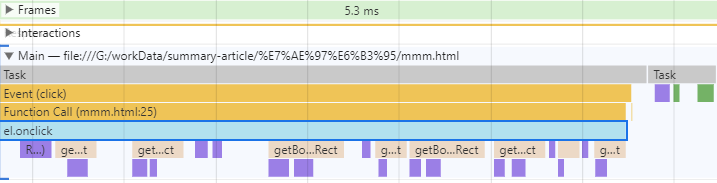

<center>缓存优化</center>

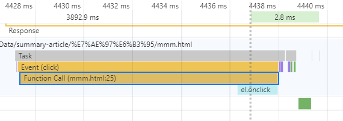

对比图片紫色的区域，读取几何属性造成多次构建渲染树与重排，时间消耗多出将近一倍，试想一下如果在真正的项目中，大量的重复读取，会造成多么恐怖的性能浪费。

## 进一步了解浏览器渲染机制

### 浏览器渲染在 event loop 哪一个阶段？

从宏任务的执行机制可以看出，在第 7 步会进行 Update the rendering（更新渲染），

### 屏幕绘制频率

即图像在屏幕上更新的速度，也即屏幕上的图像每秒钟出现的次数，它的单位是赫兹(Hz)。 对于一般电脑，这个频率大概是 60Hz， 可以在桌面上 右键 > 屏幕分辨率 > 高级设置 > 监视器 中查看和设置。这个值的设定受屏幕分辨率、屏幕尺寸和显卡的影响，原则上设置成让眼睛看着舒适的值都行。

### 动画原理

根据上面的原理我们知道，你眼前所看到图像正在以每秒 60 次的频率绘制，由于频率很高，所以你感觉不到它在绘制。而 动画本质就是要让人眼看到图像被绘制而引起变化的视觉效果，这个变化要以连贯的、平滑的方式进行过渡。 那怎么样才能做到这种效果呢？

60Hz 的屏幕每 16.7ms 绘制一次，如果在屏幕每次绘制前，将元素的位置向左移动一个像素，即 1px，这样一来，屏幕每次绘制出来的图像位置都比前一个要差 1px，你就会看到图像在移动；而由于人眼的视觉停留效应，当前位置的图像停留在大脑的印象还没消失，紧接着图像又被移到了下一个位置，这样你所看到的效果就是，图像在流畅的移动。这就是视觉效果上形成的动画。

### raf 为什么说比 setTimeout 性能更好？

setTimeout 其实就是通过设置一个间隔时间来不断的改变图像的位置，从而达到动画效果的。但我们会发现，利用 seTimeout 实现的动画在某些时候会出现卡顿、抖动的现象。 这种现象的产生有两个原因：

- setTimeout 的执行时间并不是确定的。在 JavaScript 中， setTimeout 任务被放进了异步队列中，只有当主线程上的任务执行完以后，才会去检查该队列里的任务是否需要开始执行，所以 setTimeout 的实际执行时机一般要比其设定的时间晚一些。
- 刷新频率受 屏幕分辨率 和 屏幕尺寸 的影响，不同设备的屏幕绘制频率可能会不同，而 setTimeout 只能设置一个固定的时间间隔，这个时间不一定和屏幕的刷新时间相同。

以上两种情况都会导致 setTimeout 的执行步调和屏幕的刷新步调不一致，从而引起丢帧现象。 那为什么步调不一致就会引起丢帧呢？

```js
function step() {
  el.style.height = `${++idx}px`;
  console.log(idx);
}
setTimeout(step, 0);
setTimeout(step, 4);
setTimeout(step, 8);
setTimeout(step, 12);
```

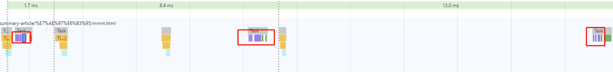

看监控图，红色的圈代表更新渲染操作，上面的函数执行以后只会执行三次渲染，跳过了第三次的更新，虽然有四次 task，但浏览器在短时间内如果有多次渲染操作会积攒到队列里，然后统一更新。

我们再来看一个更明显的例子。

```js
function step() {
  if (idx > 10) return;
  el.style.height = `${++idx}px`;
  setTimeout(step);
}
setTimeout(step);
```

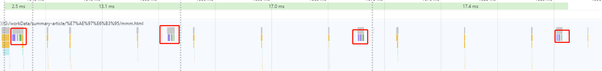

函数会递归执行 10 次更新，然后看监控图，可以明显的发现，除了第一次是正常更新渲染，后面都是执行三次 task 才执行一次渲染，这就是浏览器本身的一个优化机制，因为屏幕刷新率只有 60HZ,多余的更新都是无效的，所以自动跳过浪费的帧，如果在项目中，这些多余的操作可能会造成性能极大的一个浪费。

我们改成 raf 再试试.

```js
function step() {
  if (idx > 10) return;
  el.style.height = `${++idx}px`;
  requestAnimationFrame(step);
}
requestAnimationFrame(step);
```

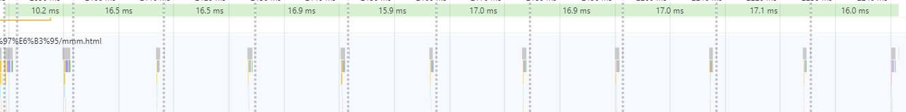

因为要尽可能的截全，task 没法展开来看，但是可以看最上面那行淡绿色的时间值，它代表的含义就是屏幕刷新率，一一对应着下面执行的 task，完美执行了每一帧的渲染，不会造成无意义的浪费。

## 渲染层合成

渲染层合成是浏览器渲染机制的最后一个环节，因为这部分内容也比较多，适合单独抽出来整理。

### 什么是渲染层合成

在 DOM 树中每个节点都会对应一个渲染对象（RenderObject），当它们的渲染对象处于相同的坐标空间（z 轴空间）时，就会形成一个 RenderLayers，也就是渲染层。渲染层将保证页面元素以正确的顺序堆叠，这时候就会出现层合成（composite），从而正确处理透明元素和重叠元素的显示。

这个模型类似于 Photoshop 的图层模型，在 Photoshop 中，每个设计元素都是一个独立的图层，多个图层以恰当的顺序在 z 轴空间上叠加，最终构成一个完整的设计图。

对于有位置重叠的元素的页面，这个过程尤其重要，因为一旦图层的合并顺序出错，将会导致元素显示异常。

### 渲染对象

一个 DOM 节点对应了一个渲染对象，渲染对象依然维持着 DOM 树的树形结构。一个渲染对象知道如何绘制一个 DOM 节点的内容，它通过向一个绘图上下文（GraphicsContext）发出必要的绘制调用来绘制 DOM 节点。

### 渲染层

这是浏览器渲染期间构建的第一个层模型，处于相同坐标空间（z 轴空间）的渲染对象，都将归并到同一个渲染层中，因此根据层叠上下文，不同坐标空间的的渲染对象将形成多个渲染层，以体现它们的层叠关系。所以，对于满足形成层叠上下文条件的渲染对象，浏览器会自动为其创建新的渲染层。能够导致浏览器为其创建新的渲染层的，包括以下几类常见的情况：

- 根元素 document
- 有明确的定位属性（relative、fixed、sticky、absolute）
- opacity < 1
- 有 CSS fliter 属性
- 有 CSS mask 属性
- 有 CSS mix-blend-mode 属性且值不为 normal
- 有 CSS transform 属性且值不为 none
- backface-visibility 属性为 hidden
- 有 CSS reflection 属性
- 有 CSS column-count 属性且值不为 auto 或者有 CSS column-width 属性且值不为 auto
- 当前有对于 opacity、transform、fliter、backdrop-filter 应用动画
- overflow 不为 visible

DOM 节点和渲染对象是一一对应的，满足以上条件的渲染对象就能拥有独立的渲染层。当然这里的独立是不完全准确的，并不代表着它们完全独享了渲染层，由于不满足上述条件的渲染对象将会与其第一个拥有渲染层的父元素共用同一个渲染层，因此实际上，这些渲染对象会与它的部分子元素共用这个渲染层。

### 图形层

GraphicsLayer 其实是一个负责生成最终准备呈现的内容图形的层模型，它拥有一个图形上下文（GraphicsContext），GraphicsContext 会负责输出该层的位图。存储在共享内存中的位图将作为纹理上传到 GPU，最后由 GPU 将多个位图进行合成，然后绘制到屏幕上，此时，我们的页面也就展现到了屏幕上。

所以 GraphicsLayer 是一个重要的渲染载体和工具，但它并不直接处理渲染层，而是处理合成层。

### 合成层

满足某些特殊条件的渲染层，会被浏览器自动提升为合成层。合成层拥有单独的 GraphicsLayer，而其他不是合成层的渲染层，则和其第一个拥有 GraphicsLayer 的父层共用一个。

那么一个渲染层满足哪些特殊条件时，才能被提升为合成层呢？这里列举了一些常见的情况：

- 3D transforms：translate3d、translateZ 等
- video、canvas、iframe 等元素
- 通过 Element.animate() 实现的 opacity 动画转换
- 通过 СSS 动画实现的 opacity 动画转换
- position: fixed
- 具有 will-change 属性
- 对 opacity、transform、fliter、backdropfilter 应用了 animation 或者 transition

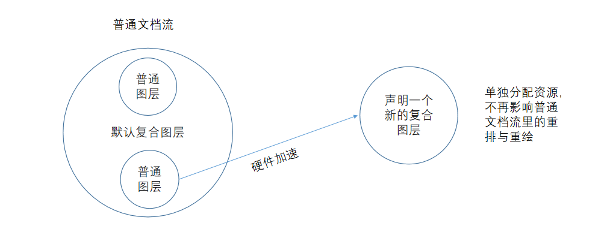

### 硬件加速

提升为合成层的渲染层会利用 GPU 开启硬件加速，合成层将分配独立资源，即使重绘与重排也不会影响到主线程的执行，由 GPU 进行处理。

普通绘制

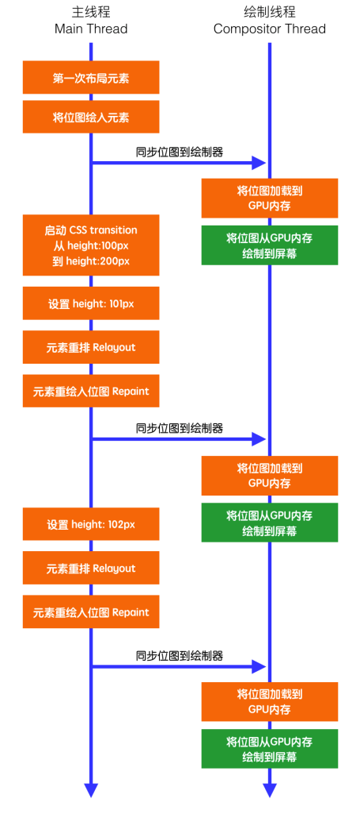

GPU 加速的绘制

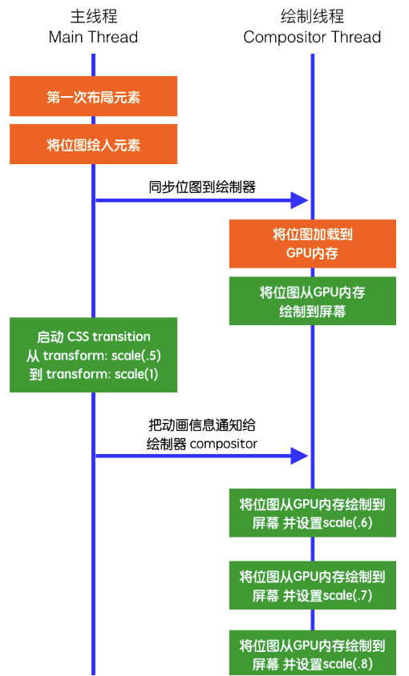

橘红色代表比较消耗性能的操作，绿色代表性能消耗很小的操作，对比普通的绘制，硬件加速技术很好的利用 GPU 的高性能，并且跳过了重排与重绘的操作，直接由 GPU 合成处理。

## 为什么 css3 动画要比普通动画性能更佳？

一般常见控制 dom 实现动画的场景：

1. 依赖父渲染层的普通元素
2. 通过浮动、定位形成的单独渲染层
3. 通过 css3 属性提升的合成层

结合浏览器最小这时候就可以得知 css3 的动画性能为何是性价比最优的，因为可以提升为合成层去渲染。而浏览器最小的绘制单元是合成层，意思就是即使通过浮动与定位将 dom 变成单独的渲染层，只能减少重排的消耗，重绘的时候还是会绘制整个合成层的元素。

所以答案是性能消耗最小的是合成层，第二的是脱离文档流的渲染层，最差的是普通元素。

## 参考资料

- [https://juejin.im/post/5a6547d0f265da3e283a1df7?utm_medium=fe&utm_source=weixinqun#heading-1](https://juejin.im/post/5a6547d0f265da3e283a1df7?utm_medium=fe&utm_source=weixinqun#heading-1)
- [https://github.com/aooy/blog/issues/5](https://github.com/aooy/blog/issues/5)
- [https://www.cnblogs.com/onepixel/p/7078617.html](https://www.cnblogs.com/onepixel/p/7078617.html)
- [https://www.html5rocks.com/zh/tutorials/internals/howbrowserswork/](https://www.html5rocks.com/zh/tutorials/internals/howbrowserswork/)
